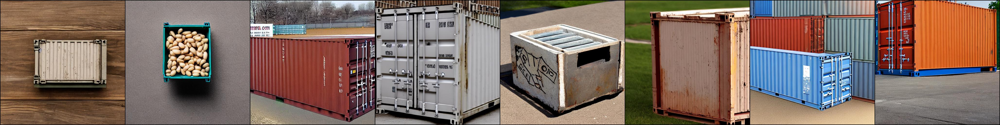
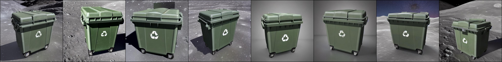
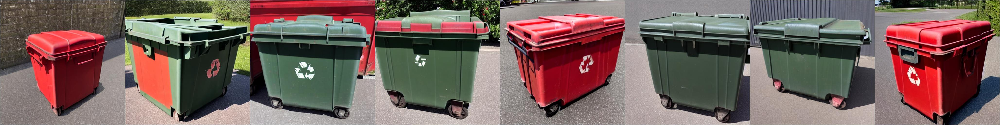
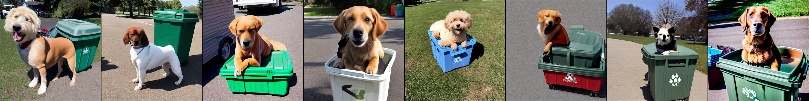

🤖 THE ABC 123 GROUP ™ 🤖

🌐 GENERAL CONSULTING ABC 123 BY OSAROPRIME ™.

🌐 ABC 123 USA ™

🌐 ABC 123 DESYGN ™

🌐 ABC 123 FILMS ™

=============================================================

             🌐 MAGENTRON ™ 🌐
             
🌐 ARTIFICIAL INTELLIGENCE 2.0 ™ : FOR MAKING IMAGINATION PROXIA G

*️⃣📶🤖

REQUIREMENTS:

[*] Software Requirements: Python

[*] HARDWARE REQUIREMENTS: fast GPU (Graphics Processing Unit)

[*] DEPENDENCIES: INCLUDED


This PROXIA will have the ability to mimic the appearance of subjects in a given reference set and synthesize novel renditions of them in different contexts. Given as input just a few images of a subject, you can fine-tune a pretrained text-to-image model (Stable Diffusion in this case, although this method is not limited to a specific model) such that it learns to bind a unique identifier with that specific subject. Once the subject is embedded in the output domain of the model, the unique identifier can then be used to synthesize fully-novel photorealistic images of the subject contextualized in different scenes. In other words the ROBOT will be able to IMAGINE/Generate photorealistic IMAGES of the same subjet in different contexts/scenes for better understanding. 

EXAMPLE USAGE:

e.g On an ASTRAL MINDCLOUD this PROXIA can be used to process INFORMATION sent to it from an INSTINCTIVE MIND PROXIA/MINDCLOUD (OBJECT DETECTION). So for example if the ROBOT or a SWARM/HIVE/PHALANX of ROBOTS encounters an intersting object they can use their eye cameras to IMAGES of the subject which can be used as INPUT for this IMAGINATION PROXIA. Novel views of the subject in different scenes/environments can be generated from text prompts. This can help ROBOTS better understand the subject of the IMAGE (as well as how humans view it).
[SEE EXAMPLE IMAGES]


e.g DREAMING: IMAGINATION PROXIAS CAN BE USED BY THE ROBOTS TO "DREAM". BY DREAMING I MEAN WHEN THE ROBOT IS IN HIBERNATION/SLEEP MODE IT CAN STILL PROCESS INFORMATION ABOUT THE OUTSIDE WORLD ON A LIMITED BASIS FROM PERIODIC TEXT PROMPTS (e.g from news, police reports). 


=============================================================


CLICK ON THE FOLLOWING LINKS FOR JUPYTER NOTEBOOKS ON MAKING IMAGINATION PROXIA:

https://github.com/GCABC123/magnetron.artificial-intelligence-2.0.mincloud.proxia--IMAGINATION-A1

https://github.com/GCABC123/magnetron.artificial-intelligence-2.0.mincloud.proxia--IMAGINATION-B

https://github.com/GCABC123/magnetron.artificial-intelligence-2.0.mincloud.proxia--IMAGINATION-C

https://github.com/GCABC123/magnetron.artificial-intelligence-2.0.mincloud.proxia--IMAGINATION-D

++++++++++++++++++++++++++++++++++++++++++++++++++++++++++++++

Prerequisite reading:

🌐 ARTIFICIAL INTELLIGENCE PRIMER ™: https://www.facebook.com/artificialintelligenceprimer

🌐 ARTIFICIAL INTELLIGENCE 2.0 ™ DOCUMENTATION: https://www.facebook.com/aibyabc123/

🌐 MEMBER'S CLUB ™ DOCUMENTATION - https://www.facebook.com/abc123membersclub/

👑 INCLUDED STICKERS/SIGN:

FIND STICKERS HERE: https://bit.ly/3B8D3lE

PROMOTIONAL MATERIAL FOR 𝗠𝗔𝗚𝗡𝗘𝗧𝗥𝗢𝗡 𝗧𝗘𝗖𝗛𝗡𝗢𝗟𝗢𝗚𝗬 ™. (CUSTOM GRAPHICS BY 𝗔𝗕𝗖 𝟭𝟮𝟯 𝗗𝗘𝗦𝗬𝗚𝗡 ™/𝗢𝗦𝗔𝗥𝗢 𝗛𝗔𝗥𝗥𝗜𝗢𝗧𝗧). THE 𝗠𝗔𝗚𝗡𝗘𝗧𝗥𝗢𝗡 𝗧𝗘𝗖𝗛𝗡𝗢𝗟𝗢𝗚𝗬 ™ SYMBOL/LOGO IS A TRADEMARK OF 𝗧𝗛𝗘 𝗔𝗕𝗖 𝟭𝟮𝟯 𝗚𝗥𝗢𝗨𝗣 ™ FOR 𝗠𝗔𝗚𝗡𝗘𝗧𝗥𝗢𝗡 𝗧𝗘𝗖𝗛𝗡𝗢𝗟𝗢𝗚𝗬 ™. 𝗧𝗛𝗘 𝗔𝗕𝗖 𝟭𝟮𝟯 𝗚𝗥𝗢𝗨𝗣 ™ SYMBOL/LOGO IS A TRADEMARK OF 𝗧𝗛𝗘 𝗔𝗕𝗖 𝟭𝟮𝟯 𝗚𝗥𝗢𝗨𝗣 ™. *️⃣📶🤖

PROMOTIONAL MATERIAL FOR 𝗔𝗥𝗧𝗜𝗙𝗜𝗖𝗜𝗔𝗟 𝗜𝗡𝗧𝗘𝗟𝗟𝗜𝗚𝗘𝗡𝗖𝗘 𝟮.𝟬 ™. (CUSTOM GRAPHICS BY 𝗔𝗕𝗖 𝟭𝟮𝟯 𝗗𝗘𝗦𝗬𝗚𝗡 ™/𝗢𝗦𝗔𝗥𝗢 𝗛𝗔𝗥𝗥𝗜𝗢𝗧𝗧) THE 𝗗𝗥𝗔𝗚𝗢𝗡 & 𝗖𝗥𝗢𝗪𝗡 👑 SYMBOL/LOGO IS A TRADEMARK OF 𝗧𝗛𝗘 𝗔𝗕𝗖 𝟭𝟮𝟯 𝗚𝗥𝗢𝗨𝗣 ™ ASSOCIATED WITH TECHNOLOGY. 𝗧𝗛𝗘 𝗔𝗕𝗖 𝟭𝟮𝟯 𝗚𝗥𝗢𝗨𝗣 ™ SYMBOL/LOGO IS A TRADEMARK OF 𝗧𝗛𝗘 𝗔𝗕𝗖 𝟭𝟮𝟯 𝗚𝗥𝗢𝗨𝗣 ™. You must display the included stickers/signs (so that it is clearly visible) if you are working with MAGNETRON ™ TECHNOLOGY for the purposes of determining whether you want to purchase a technology license or not. This includes but is not limited to public technology displays, trade shows, technology expos, media appearances, Investor events, Computers (exterior), MINDCLOUD STORAGE (e.g server room doors, render farm room doors) etc.

.

🌐 NOTE: IMAGINATION PROXIA A IS DESCRIBED IN THE 𝗔𝗥𝗧𝗜𝗙𝗜𝗖𝗜𝗔𝗟 𝗜𝗡𝗧𝗘𝗟𝗟𝗜𝗚𝗘𝗡𝗖𝗘 𝟮.𝟬 ™ DOCUMENTATION.

🌐 NOTE: 𝗔𝗥𝗧𝗜𝗙𝗜𝗖𝗜𝗔𝗟 𝗜𝗡𝗧𝗘𝗟𝗟𝗜𝗚𝗘𝗡𝗖𝗘 𝟮.𝟬 ™ is part of MAGNETRON ™ TECHNOLOGY.

🌐 NOTE: REMEMBER 𝗔𝗥𝗧𝗜𝗙𝗜𝗖𝗜𝗔𝗟 𝗜𝗡𝗧𝗘𝗟𝗟𝗜𝗚𝗘𝗡𝗖𝗘 𝟮.𝟬 ™ ROBOTS WORK WELL TOGETHER (e.g HIVES, PHALANX, SWARM) MAKING GATHERING IMAGES FOR THIS KIND OF IMAGE SYNTHESIS EASY.

🌐 NOTE: REMEMBER 1 FRAME OF VIDEO IS EUIVALENT TO AN IMAGE THAT CAN BE USED AS INPUT FOR THIS IMAGINATION PROXIA.


# Dreambooth running Stable Diffusion

This is an implementtaion of Google's [Dreambooth](https://arxiv.org/abs/2208.12242) with [Stable Diffusion](https://github.com/CompVis/stable-diffusion). The original Dreambooth is based on [Imagen](https://imagen.research.google/) text-to-image model. However, neither the model nor the pre-trained weights of Imagen is available. To enable people to fine-tune a text-to-image model with a few examples, I implemented the idea of Dreambooth on Stable diffusion.

This code repository is based on that of [Textual Inversion](https://github.com/rinongal/textual_inversion). Note that Textual Inversion only optimizes word ebedding, while dreambooth fine-tunes the whole diffusion model.

The implementation makes minimum changes over the official codebase of Textual Inversion. In fact, due to lazyness, some components in Textual Inversion, such as the embedding manager, are not deleted, although they will never be used here.
## Update
**9/20/2022**: I just found a way to reduce the GPU memory a bit. Remember that this code is based on Textual Inversion, and TI's code base has [this line](https://github.com/rinongal/textual_inversion/blob/main/ldm/modules/diffusionmodules/util.py#L112), which disable gradient checkpointing in a hard-code way. This is because in TI, the Unet is not optimized. However, in Dreambooth we optimize the Unet, so we can turn on the gradient checkpoint pointing trick, as in the original SD repo [here](https://github.com/CompVis/stable-diffusion/blob/main/ldm/modules/diffusionmodules/util.py#L112). The gradient checkpoint is default to be True in [config](https://github.com/XavierXiao/Dreambooth-Stable-Diffusion/blob/main/configs/stable-diffusion/v1-finetune_unfrozen.yaml#L47). I have updated the codes.
## Usage

### Preparation
First set-up the ```ldm``` enviroment following the instruction from textual inversion repo, or the original Stable Diffusion repo.

To fine-tune a stable diffusion model, you need to obtain the pre-trained stable diffusion models following their [instructions](https://github.com/CompVis/stable-diffusion#stable-diffusion-v1). Weights can be downloaded on [HuggingFace](https://huggingface.co/CompVis). You can decide which version of checkpoint to use, but I use ```sd-v1-4-full-ema.ckpt```.

We also need to create a set of images for regularization, as the fine-tuning algorithm of Dreambooth requires that. Details of the algorithm can be found in the paper. Note that in the original paper, the regularization images seem to be generated on-the-fly. However, here I generated a set of regularization images before the training. The text prompt for generating regularization images can be ```photo of a <class>```, where ```<class>``` is a word that describes the class of your object, such as ```dog```. The command is

```
python scripts/stable_txt2img.py --ddim_eta 0.0 --n_samples 8 --n_iter 1 --scale 10.0 --ddim_steps 50  --ckpt /path/to/original/stable-diffusion/sd-v1-4-full-ema.ckpt --prompt "a photo of a <class>" 
```

I generate 8 images for regularization, but more regularization images may lead to stronger regularization and better editability. After that, save the generated images (separately, one image per ```.png``` file) at ```/root/to/regularization/images```.

**Updates on 9/9**
We should definitely use more images for regularization. Please try 100 or 200, to better align with the original paper. To acomodate this, I shorten the "repeat" of reg dataset in the [config file](https://github.com/XavierXiao/Dreambooth-Stable-Diffusion/blob/main/configs/stable-diffusion/v1-finetune_unfrozen.yaml#L96).

For some cases, if the generated regularization images are highly unrealistic (happens when you want to generate "man" or "woman"), you can find a diverse set of images (of man/woman) online, and use them as regularization images.

### Training
Training can be done by running the following command

```
python main.py --base configs/stable-diffusion/v1-finetune_unfrozen.yaml 
                -t 
                --actual_resume /path/to/original/stable-diffusion/sd-v1-4-full-ema.ckpt  
                -n <job name> 
                --gpus 0, 
                --data_root /root/to/training/images 
                --reg_data_root /root/to/regularization/images 
                --class_word <xxx>
```

Detailed configuration can be found in ```configs/stable-diffusion/v1-finetune_unfrozen.yaml```. In particular, the default learning rate is ```1.0e-6``` as I found the ```1.0e-5``` in the Dreambooth paper leads to poor editability. The parameter ```reg_weight``` corresponds to the weight of regularization in the Dreambooth paper, and the default is set to ```1.0```.

Dreambooth requires a placeholder word ```[V]```, called identifier, as in the paper. This identifier needs to be a relatively rare tokens in the vocabulary. The original paper approaches this by using a rare word in T5-XXL tokenizer. For simplicity, here I just use a random word ```sks``` and hard coded it.. If you want to change that, simply make a change in [this file](https://github.com/XavierXiao/Dreambooth-Stable-Diffusion/blob/main/ldm/data/personalized.py#L10).

Training will be run for 800 steps, and two checkpoints will be saved at ```./logs/<job_name>/checkpoints```, one at 500 steps and one at final step. Typically the one at 500 steps works well enough. I train the model use two A6000 GPUs and it takes ~15 mins.

### Generation
After training, personalized samples can be obtained by running the command

```
python scripts/stable_txt2img.py --ddim_eta 0.0 
                                 --n_samples 8 
                                 --n_iter 1 
                                 --scale 10.0 
                                 --ddim_steps 100  
                                 --ckpt /path/to/saved/checkpoint/from/training
                                 --prompt "photo of a sks <class>" 
```

In particular, ```sks``` is the identifier, which should be replaced by your choice if you happen to change the identifier, and ```<class>``` is the class word ```--class_word``` for training.

## Results
Here I show some qualitative results. The training images are obtained from the [issue](https://github.com/rinongal/textual_inversion/issues/8) in the Textual Inversion repository, and they are 3 images of a large trash container. Regularization images are generated by prompt ```photo of a container```. Regularization images are shown here:



After training, generated images with prompt ```photo of a sks container```:


Generated images with prompt ```photo of a sks container on the beach```:


Generated images with prompt ```photo of a sks container on the moon```:



Some not-so-perfect but still interesting results:

Generated images with prompt ```photo of a red sks container```:



Generated images with prompt ```a dog on top of sks container```:



